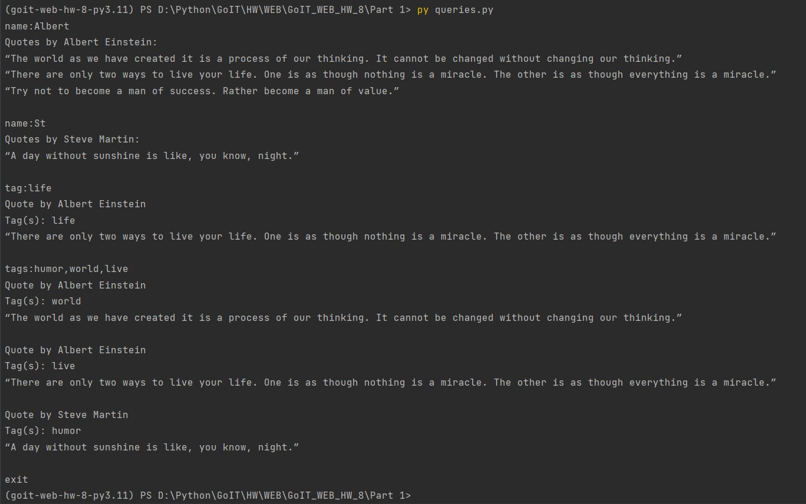
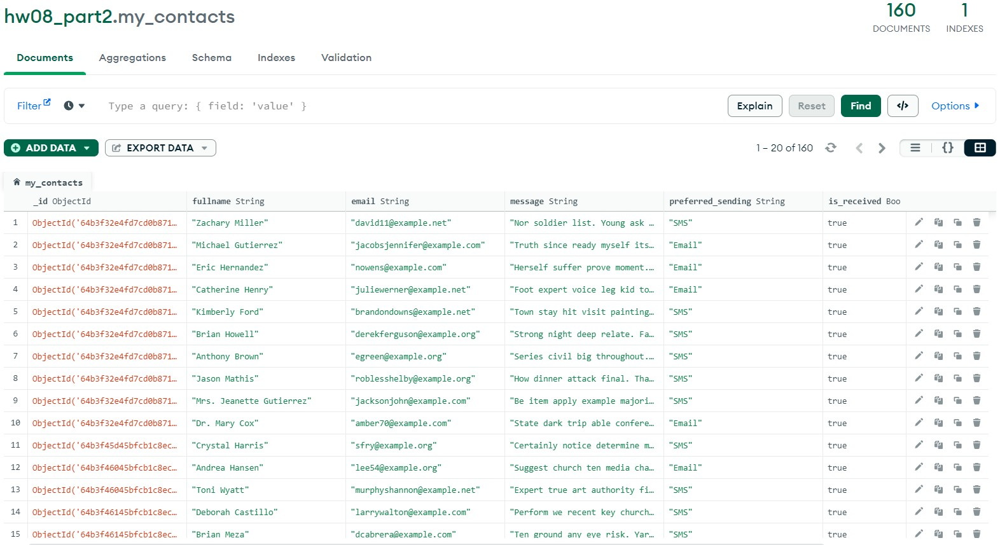

# GoIT_WEB_HW_8
Individual homework №8 at GoIT school: **`NoSQL`, `MongoDB`, `Redis`, `RabbitMQ`**

## Description 
### Part I
In this part, we work with `Atlas MongoDB` cloud database, `ODM Mongoengine` and `json` files, and perform caching to the `Redis` database.

Initially, we have two files: the `authors.json` file includes the author's name, his date and place of birth, and a short biography; the file `quotes.json` includes the author's name, his quotes, and the tags for each quote.
We put the data from these files into the `MongoDB` database. We can then work with this data, e.g., search for quotes by one or more tags or by author name. 

### Part II
In this part, we also work with the `Atlas MongoDB` cloud database using `ODM Mongoengine` and connect the `CloudAMQP` service with `RabbitMQ` on board to use the message exchange.

First we connect to `RabbitMQ` and the `MongoDB`. Then we generate random contacts with fields such as: `name`, `email`, `message` and `preferred_sending` (preferred method of sending a message: Email or SMS). We write these contacts to the database with the `is_sent` boolean field set to `False`, which means the message is generated but not yet sent. The ID of each contact is then placed in the appropriate queue (Email or SMS). And finally we run our workers,consumers, each running their own queue on RabbitMQ and simulate sending messages.


## Running the program
## Part I

To start working with this project you need to have access to `MomgoDB`, `Redis` and `RabbitMQ`. For example, you can use cloud services like `Atlas MongoDB` and `CloudAMQP` or you can use Docker on your local machine.

• Clone this repository to your PC. To do this, run the command line and type
```
git clone https://github.com/S-Stepanov-1/GoIT_WEB_HW_8.git
```
• After that you need to install the dependencies. Use command
```
poetry install
```
• Now we need to connect to a database, create collections and fill them with data from the json files. To do this, run the `upload_to_DB.py` script with the following command:
```
py upload_to_DB.py
```
• In order to cache our queries, we need to bring up the `Redis` server. This can be done in the `Docker` container with the following command:
```
docker run --name redis-cache -d -p 6379:6379 redis
```
Caching allows us not to make queries to the database, but to take a response from the cache if the query is repeated. This does not load the database and allows us to get the response much faster.
• After that, we can run queries against the database. Execute the command:
```
py queries.py
```
In the window that opens, you can enter your search queries, for example:
`name:Albert Einstein`
`name:Steve`
`tag:life`
`tags:humor,world`

Please note that you can enter the author's name not in full, but only the first letters (see the example in the picture below).

### Example I


## Part II

To get started with `RabbitMQ` message broker you need to follow these steps.

• You need to connect to RabbitMQ. In this work we used the cloud service CloudAMQP.
• You also need to generate our contacts, add them to the database and place them in the appropriate queue in RabbitMQ. We use the faker library to populate the database.
```
py producer.py
```
• Now we can start our consumers, these are our workers. They connect to their `RabbitMQ` queues and simulate sending messages to contacts by SMS or E-mail.
```
py consumer_email.py
```
and
```
py consumer_sms.py
```
After consumers have done their work, the `is_recived` field is `True`.

### Example II



